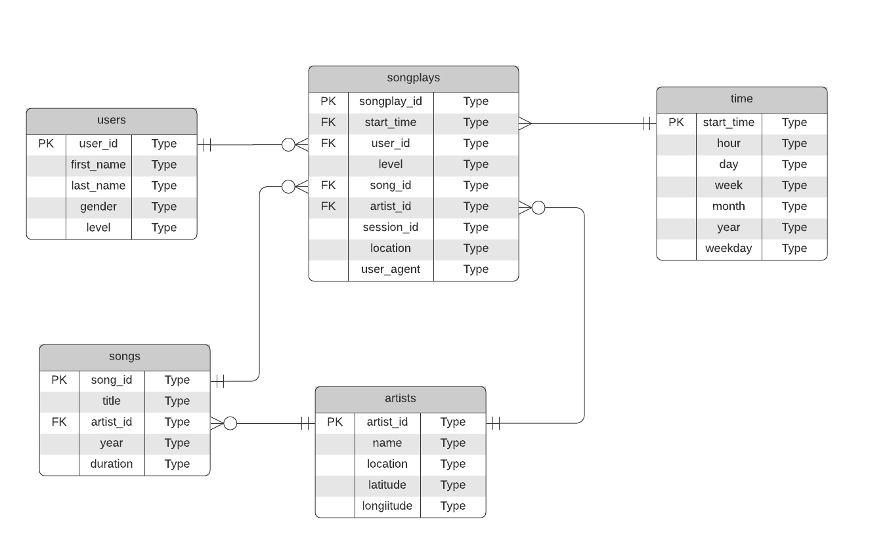

# rdbms-data-modeling

## Database Schema



## Files
- database.ini: database credentials
- create_tables.py: run script to create database tables described on the image above
- etl.py: run script to tranfer all the data from folder `data` to database
- sql_queries.py: all queries
- etl.ipynb: step-by-step to tutorial on how to prepare the data for insertion

## Usage

1. Starting local PostgreSQL instance:
```
docker-compose up
```

You can edit your database credentials in `database.ini`

2. Create the database running:
```
python create_tables.py
```

3. (optional) Run ETL.ipynb in order to check the full pipeline

4. Run `elt.py`: it will read and process all the files from `song_data` and `log_data`, loading them into the database

## Details

The data insertion is done using three different approaches from `psycopg2`:

- copy_from
- execute(simple insertition statement)
- executemany


